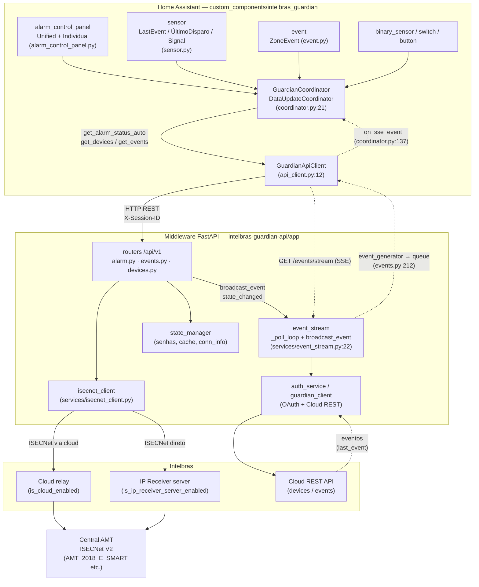
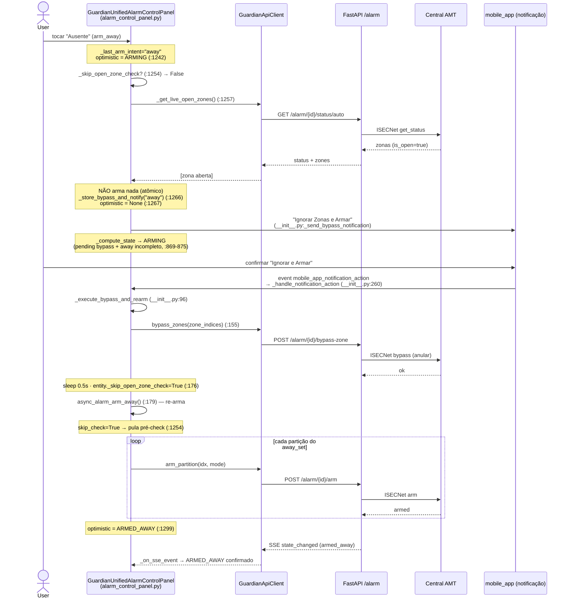
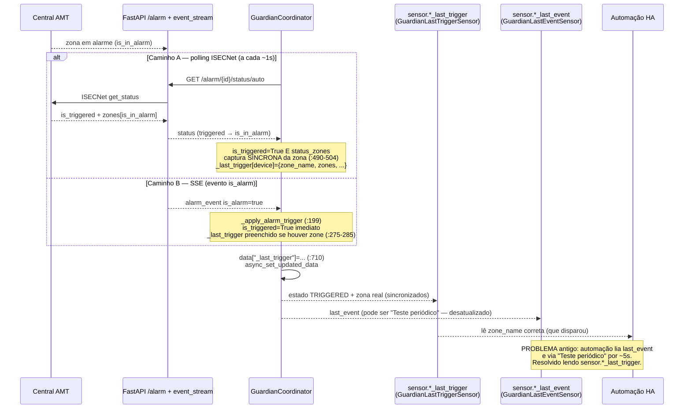
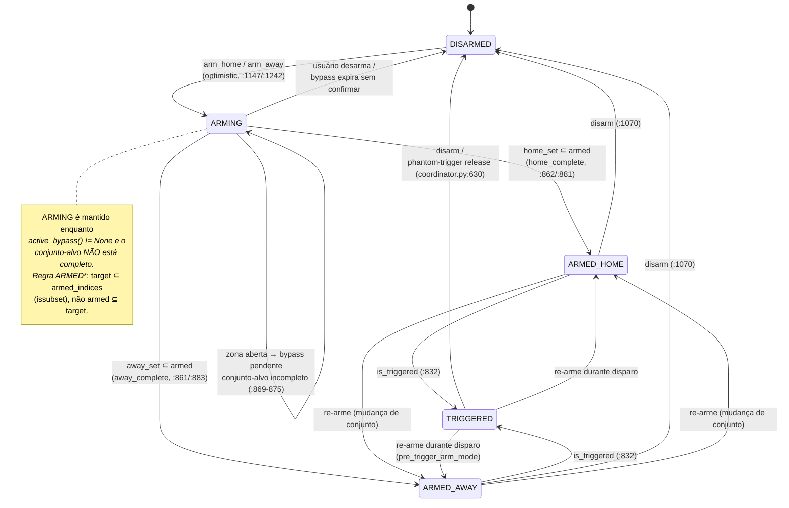
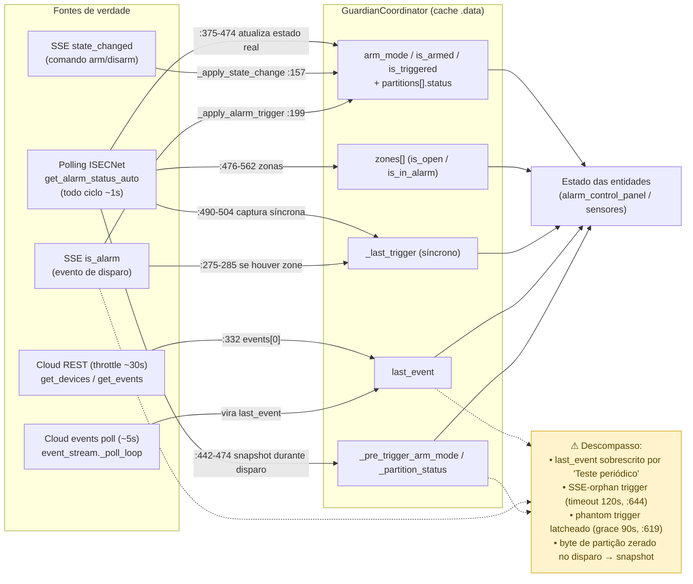

# Intelbras Guardian — Diagramas de Arquitetura e Fluxos

> Diagramas em Mermaid **validados contra o código real** (incluindo mudanças
> ainda não commitadas: pré-check atômico de arme em `alarm_control_panel.py`
> e o sensor `_last_trigger` em `coordinator.py`/`sensor.py`). Cada diagrama traz
> referências a `arquivo:linha` que comprovam o fluxo.
>
> Caminhos relativos à raiz do projeto:
> - `cc/` = `custom_components/intelbras_guardian/`
> - `api/` = `intelbras-guardian-api/app/`

---

## 1. Arquitetura de componentes

O Home Assistant cria entidades por plataforma (`alarm_control_panel`, `sensor`,
`event`, etc. — `cc/const.py:73`), todas `CoordinatorEntity` ligadas ao
`GuardianCoordinator` (`cc/coordinator.py:21`). O coordinator fala com o
middleware via `GuardianApiClient` (`cc/api_client.py:12`), que faz HTTP REST
contra a FastAPI (`api/main.py:58`, router em `api/api/v1/alarm.py:24`). O
serviço `isecnet_client` abre a conexão ISECNet com a central AMT, escolhendo
entre **Cloud relay** ou **IP Receiver** conforme `_get_device_connection_info`
(`api/api/v1/alarm.py:153`, decisão em `:186-207`). Em paralelo, o canal **SSE**:
`event_stream` (`api/services/event_stream.py:22`) faz polling da nuvem
(`_poll_loop` `:123`) e também recebe `broadcast_event` direto dos comandos
arm/disarm (`api/api/v1/alarm.py:510`,`:625`); o endpoint `/events/stream`
(`api/api/v1/events.py:244`) entrega os eventos ao `listen_sse_events`
(`cc/api_client.py:448`), que chama `coordinator._on_sse_event`
(`cc/coordinator.py:137`).

---

## 2. Sequência — Armar "Ausente" com zona aberta (comportamento ATÔMICO pós-fix)

Ao tocar **Ausente**, `async_alarm_arm_away` grava `_last_arm_intent="away"` e
otimisticamente vai para `ARMING` (`cc/alarm_control_panel.py:1235-1243`). Antes
de armar qualquer partição, `_execute_arm_away` faz um **pré-check ao vivo** das
zonas abertas via `_get_live_open_zones` (`:1257`, que chama
`get_alarm_status_auto`). Se houver zona aberta, **NADA é armado** (evita disparar
a sirene numa partição enquanto a outra fica pendente): registra o bypass
pendente com `_store_bypass_and_notify` (`:1266`), limpa o estado otimista e
retorna — o `_compute_state` então reporta **ARMING** porque há bypass pendente e
o conjunto-alvo não está completo (`:869-875`). A notificação acionável "Ignorar
Zonas e Armar" é enviada ao mobile (`cc/__init__.py:27`). Quando o usuário
confirma, o evento `mobile_app_notification_action` cai em
`_handle_notification_action` (`cc/__init__.py:260`) → `_execute_bypass_and_rearm`
(`cc/__init__.py:96`): faz `bypass_zones` (`:155`), aguarda 0.5s, marca
`entity._skip_open_zone_check=True` (`:176`) e re-chama `async_alarm_arm_away()`
(`:179`). Dessa vez o pré-check é pulado (`:1254-1256`), todas as partições do
away set são armadas → **ARMED_AWAY**.

---

## 3. Sequência — Disparo → notificação correta (sensor `Último Disparo`)

Quando a central dispara, o coordinator detecta `is_triggered` por **dois
caminhos**: (a) polling ISECNet — `get_alarm_status_auto` traz `is_triggered` e as
zonas com `is_in_alarm` (`api/api/v1/alarm.py:811` mapeia `triggered`→`is_in_alarm`);
ou (b) SSE — evento `is_alarm` cai em `_apply_alarm_trigger`
(`cc/coordinator.py:199`). No caminho de polling, assim que `is_triggered` é
verdadeiro **e** há zonas, o coordinator captura **sincronamente** a zona em
alarme em `_last_trigger` (`cc/coordinator.py:490-504`), priorizando zonas com
`is_in_alarm`. Esse dicionário é exposto em `data["_last_trigger"]` (`:710`) e
lido pelo sensor `GuardianLastTriggerSensor` (`cc/sensor.py:180`, `_trigger()`
`:207-210`), que atualiza junto com o estado `triggered`. **Problema antigo que
isso resolve:** o sensor `Último Evento` (`GuardianLastEventSensor`,
`cc/sensor.py:93`) usa `last_event`, que é constantemente sobrescrito por
eventos de rotina (ex.: "Teste periódico" da nuvem a cada ~hora), então uma
automação disparada em `triggered` que lia `last_event` via de regra via o
evento errado por ~5s até o próximo poll. O `_last_trigger` só é atualizado por
um disparo real e nunca por eventos de rotina.

---

## 4. Máquina de estados do painel unificado

A função `_compute_state` (`cc/alarm_control_panel.py:810`) define a verdade do
estado, com prioridade explícita: (1) `TRIGGERED` quando o device está disparado;
(2) `ARMING` enquanto há **bypass pendente** e o conjunto-alvo ainda não está
totalmente armado (`:869-875`) — é o estado mantido enquanto a zona aberta
aguarda a confirmação "Ignorar e Armar"; (3) `DISARMED` se nenhuma partição
armada; (4) `ARMED_HOME`/`ARMED_AWAY` **somente quando TODAS as partições do
conjunto-alvo estão armadas** (`target ⊆ armed`, via `issubset` em `:861-862`,
`:881-884`) — uma única partição armada já não declara o conjunto inteiro armado;
(5) fallback por topologia/contagem de modos. O `_last_arm_intent` ("home"/"away")
é persistido entre restarts via `RestoreEntity` (`async_added_to_hass` `:694`) e
limpo quando a API confirma `is_armed=False` (`_handle_coordinator_update`
`:1033-1046`) ou ao desarmar (`:1074`).

---

## 5. Fontes de verdade / fluxo de dados

Três fontes alimentam o estado, com cadências diferentes. **Polling ISECNet:**
`_async_update_data` roda a cada `DEFAULT_SCAN_INTERVAL=1s` (`cc/const.py:13`);
chama `get_alarm_status_auto` **todo ciclo** (estado em tempo real:
arm_mode/is_triggered/zonas), mas faz throttle das chamadas de nuvem
(`get_devices`/`get_events`) para a cada ~30s (`cloud_api_interval`,
`cc/coordinator.py:92-96`,`:310-336`). **SSE:** eventos `state_changed`
(emitidos pelos próprios comandos arm/disarm, `api/api/v1/alarm.py:510`,`:625`)
→ `_apply_state_change` (`cc/coordinator.py:157`) atualiza partição/arm_mode
direto no cache; eventos `is_alarm` → `_apply_alarm_trigger`
(`cc/coordinator.py:199`) marca triggered imediato. **Eventos da nuvem:**
`event_stream._poll_loop` (`api/services/event_stream.py:123`) faz polling da
REST a cada 5s e vira `last_event` / sensor `Último Evento`. **Risco de
descompasso:** (a) `last_event` (nuvem) reflete o último evento de QUALQUER tipo,
incluindo "Teste periódico" — por isso o `_last_trigger` síncrono do diagrama 3;
(b) triggers só por SSE que a API nunca confirma ("SSE-orphan") são liberados por
timeout (`_triggered_timeout=120s`, `:644-660`); (c) trigger "fantasma" latcheado
pela central mesmo sem zona em alarme é liberado após `_phantom_trigger_grace=90s`
(`:619-643`); (d) durante disparo a AMT_2018_E_SMART zera o byte de partição, daí
o snapshot `_pre_trigger_arm_mode`/`_pre_trigger_partition_status` (`:442-474`).

